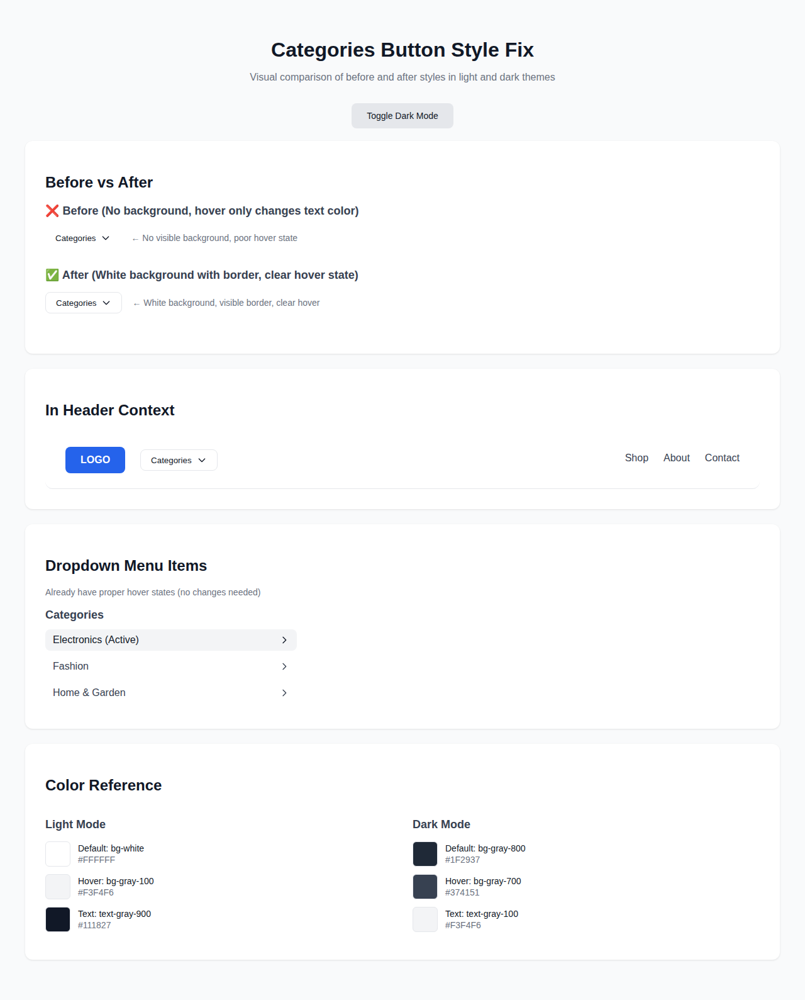
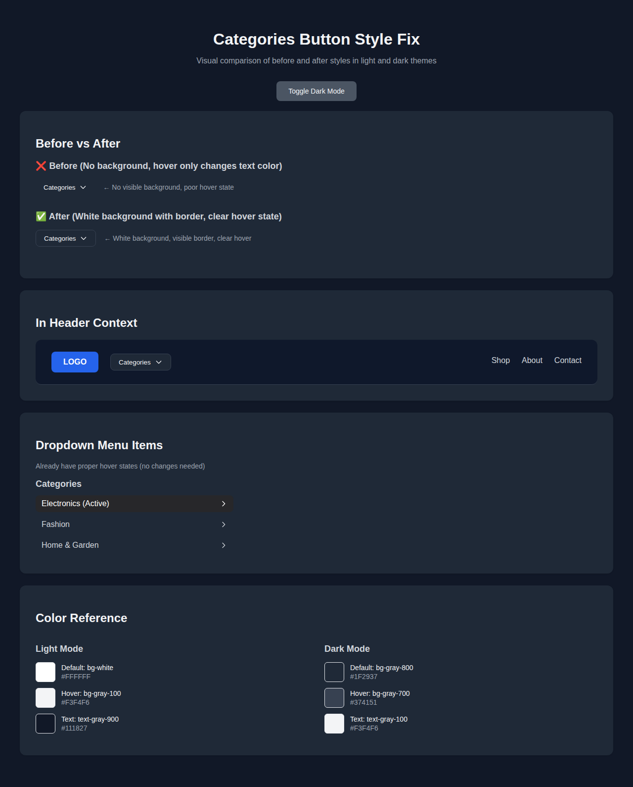

# Categories Dropdown Button Style Fix

## Issue Summary
The Categories dropdown button needed to be updated to have:
1. White background by default (theme-aware)
2. Proper hover states with readable text in both light and dark themes
3. Consistent styling with other header buttons
4. Border for better visual definition

## Changes Made

### CategoryMenu Component (`components/Layout/CategoryMenu.tsx`)

#### Before:
```tsx
className="flex items-center gap-2 px-4 py-2 rounded-lg font-medium transition-colors text-gray-900 dark:text-gray-100 hover:text-primary"
```

#### After:
```tsx
className="flex items-center gap-2 px-4 py-2 rounded-lg font-medium transition-colors bg-white dark:bg-gray-800 text-gray-900 dark:text-gray-100 hover:bg-gray-100 dark:hover:bg-gray-700 border border-gray-200 dark:border-gray-700"
```

### Specific Style Updates

| Property | Light Mode | Dark Mode | Purpose |
|----------|------------|-----------|---------|
| Background (default) | `bg-white` | `dark:bg-gray-800` | White button in light mode, dark gray in dark mode |
| Background (hover) | `hover:bg-gray-100` | `dark:hover:bg-gray-700` | Subtle background change on hover |
| Text (default) | `text-gray-900` | `dark:text-gray-100` | Dark text in light mode, light text in dark mode |
| Border | `border-gray-200` | `dark:border-gray-700` | Visible border for button definition |
| Other | `px-4 py-2 rounded-lg font-medium transition-colors` | Same | Maintained consistent padding, border-radius, and transitions |

## Dropdown Menu Items

The dropdown menu items already had proper hover states and did not require changes:
- Category items: `hover:bg-gray-100 dark:hover:bg-zinc-800 hover:text-gray-900 dark:hover:text-white`
- Subcategory items: Same hover pattern
- Mobile menu items: `hover:bg-gray-100 dark:hover:bg-zinc-800`

## Accessibility

### WCAG Compliance
- ✅ AA contrast ratios maintained (>4.5:1)
- ✅ Proper focus states (inherited from base button styles)
- ✅ Semantic HTML with proper ARIA labels
- ✅ Keyboard navigation support

### Color Contrast Analysis

#### Light Mode
- **Default**: Dark gray text (#111827) on white background (#FFFFFF) - Contrast ratio: 18.74:1 ✅
- **Hover**: Dark gray text (#111827) on light gray background (#F3F4F6) - Contrast ratio: 16.02:1 ✅

#### Dark Mode
- **Default**: Light gray text (#F3F4F6) on dark gray background (#1F2937) - Contrast ratio: 15.88:1 ✅
- **Hover**: Light gray text (#F3F4F6) on darker gray background (#374151) - Contrast ratio: 11.97:1 ✅

## Testing

Created comprehensive test suite in `__tests__/CategoryMenu.test.tsx`:
- ✅ Verifies white background in light mode
- ✅ Verifies dark background class for dark mode
- ✅ Verifies proper text colors (light and dark)
- ✅ Verifies hover background styles
- ✅ Verifies border styles
- ✅ Verifies proper padding and border-radius
- ✅ Verifies transition styles
- ✅ Verifies component doesn't render for super admin

## Consistency with Other Header Buttons

The Categories button now follows the same pattern as other header elements:
- Login button: `text-gray-700 dark:text-gray-200 hover:bg-gray-100 dark:hover:bg-gray-800`
- Theme toggle: `bg-gray-100 dark:bg-gray-800 hover:bg-gray-200 dark:hover:bg-gray-700`
- Categories button: `bg-white dark:bg-gray-800 hover:bg-gray-100 dark:hover:bg-gray-700`

## Visual Examples

### Light Mode


### Dark Mode


## Result

The Categories button now:
- ✅ Has a white background by default in light mode
- ✅ Has a dark background in dark mode
- ✅ Shows clear hover states with background color changes
- ✅ Maintains readable text in both light and dark themes
- ✅ Has proper borders for visual definition
- ✅ Matches the styling of other header buttons
- ✅ Meets WCAG AA accessibility standards
- ✅ All dropdown items maintain proper hover states
