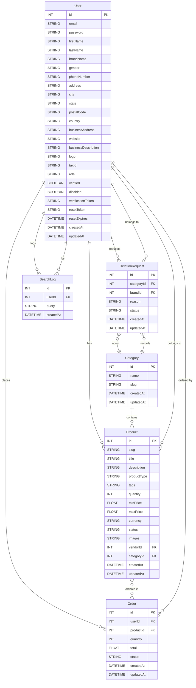

# Database ERD

```mermaid
erDiagram
    User {
      INT id PK
      STRING email
      STRING password
      STRING firstName
      STRING lastName
      STRING brandName
      STRING gender
      STRING phoneNumber
      STRING address
      STRING city
      STRING state
      STRING postalCode
      STRING country
      STRING businessAddress
      STRING website
      STRING businessDescription
      STRING logo
      STRING taxId
      STRING role
      BOOLEAN verified
      BOOLEAN disabled
      STRING verificationToken
      STRING resetToken
      DATETIME resetExpires
      DATETIME createdAt
      DATETIME updatedAt
    }
    Category {
      INT id PK
      STRING name
      STRING slug
      DATETIME createdAt
      DATETIME updatedAt
    }
    Product {
      INT id PK
      STRING slug
      STRING title
      STRING description
      STRING productType
      STRING tags
      INT quantity
      FLOAT minPrice
      FLOAT maxPrice
      STRING currency
      STRING status
      STRING images
      INT vendorId FK
      INT categoryId FK
      DATETIME createdAt
      DATETIME updatedAt
    }
    Order {
      INT id PK
      INT userId FK
      INT productId FK
      INT quantity
      FLOAT total
      STRING status
      DATETIME createdAt
      DATETIME updatedAt
    }
    DeletionRequest {
      INT id PK
      INT categoryId FK
      INT brandId FK
      STRING reason
      STRING status
      DATETIME createdAt
      DATETIME updatedAt
    }
    SearchLog {
      INT id PK
      INT userId FK
      STRING query
      DATETIME createdAt
    }

    User ||--o{ Product : "has"
    User ||--o{ Order : "places"
    User ||--o{ DeletionRequest : "requests"
    User ||--o{ SearchLog : "logs"
    Category ||--o{ Product : "contains"
    Category ||--o{ DeletionRequest : "records"
    Product }o--o{ Order : "ordered in"
    Product }o--|| User : "belongs to"
    Order }o--|| User : "ordered by"
    DeletionRequest }o--|| User : "belongs to"
    DeletionRequest }o--|| Category : "about"
    SearchLog }o--|| User : "by"
```
